# OpenAI Spinning Up

## 3. Intro to Policy Optimization

URL: https://spinningup.openai.com/en/latest/spinningup/rl_intro3.html

We will cover three key results in the theory of **policy gradients**:

- [the simplest equation](https://spinningup.openai.com/en/latest/spinningup/rl_intro3.html#deriving-the-simplest-policy-gradient) describing the gradient of policy performance with respect to policy parameters,
- a rule which allows us to [drop useless terms](https://spinningup.openai.com/en/latest/spinningup/rl_intro3.html#don-t-let-the-past-distract-you) from that expression,
- and a rule which allows us to [add useful terms](https://spinningup.openai.com/en/latest/spinningup/rl_intro3.html#baselines-in-policy-gradients) to that expression.

In the end, we’ll tie those results together and describe the advantage-based expression for the policy gradient—the version we use in our [Vanilla Policy Gradient](https://spinningup.openai.com/en/latest/algorithms/vpg.html) implementation.

### Deriving the Simplest Policy Gradient

Here, we consider the case of a stochastic, parameterized policy, . We aim to maximize the expected return . For the purposes of this derivation, we’ll take  to give the [finite-horizon undiscounted return](https://spinningup.openai.com/en/latest/spinningup/rl_intro.html#reward-and-return), but the derivation for the infinite-horizon discounted return setting is almost identical.

We would like to optimize the policy by gradient ascent, eg


The gradient of policy performance, , is called the **policy gradient**, and algorithms that optimize the policy this way are called **policy gradient algorithms.** (Examples include Vanilla Policy Gradient and TRPO. PPO is often referred to as a policy gradient algorithm, though this is slightly inaccurate.)

To actually use this algorithm, we need an expression for the policy gradient which we can numerically compute. This involves two steps: 

1. deriving the analytical gradient of policy performance, which turns out to have the form of an expected value, and then
2. forming a sample estimate of that expected value, which can be computed with data from a finite number of agent-environment interaction steps.

In this subsection, we’ll find the simplest form of that expression. In later subsections, we’ll show how to improve on the simplest form to get the version we actually use in standard policy gradient implementations.

We’ll begin by laying out a few facts which are useful for deriving the analytical gradient.

**1. Probability of a Trajectory.** The probability of a trajectory  given that actions come from  is


**2. The Log-Derivative Trick.** The log-derivative trick is based on a simple rule from calculus: the derivative of  with respect to  is . When rearranged and combined with chain rule, we get:


**3. Log-Probability of a Trajectory.** The log-prob of a trajectory is just


**4. Gradients of Environment Functions.** The environment has no dependence on , so gradients of , , and  are zero.

**5. Grad-Log-Prob of a Trajectory.** The gradient of the log-prob of a trajectory is thus


**Derivation for Basic Policy Gradient**


This is an expectation, which means that we can estimate it with a sample mean. If we collect a set of trajectories  where each trajectory is obtained by letting the agent act in the environment using the policy , the policy gradient can be estimated with


where  is the number of trajectories in  (here, ).

This last expression is the simplest version of the computable expression we desired. Assuming that we have represented our policy in a way which allows us to calculate , and if we are able to run the policy in the environment to collect the trajectory dataset, we can compute the policy gradient and take an update step.

### Implementing the Simplest Policy Gradient

We give a short Tensorflow implementation of this simple version of the policy gradient algorithm in `spinup/examples/pg_math/1_simple_pg.py`. (It can also be viewed [on github](https://github.com/openai/spinningup/blob/master/spinup/examples/pg_math/1_simple_pg.py).) It is only 122 lines long, so we highly recommend reading through it in depth. While we won’t go through the entirety of the code here, we’ll highlight and explain a few important pieces.

**1. Making the Policy Network.**

```python
# make core of policy network
obs_ph = tf.placeholder(shape=(None, obs_dim),dtype=tf.float32)
logits = mlp(obs_ph, sizes=hidden_sizes+[n_acts])

# make action selection op (outputs int actions, sampled from policy)
actions = tf.squeeze(tf.multinomial(logits=logits, num_samples=1), axis=1)
```

This block builds a feedforward neural network categorical policy. (See the [Stochastic Policies](https://spinningup.openai.com/en/latest/spinningup/rl_intro.html#stochastic-policies) section in Part 1 for a refresher.) The `logits` tensor can be used to construct log-probabilities and probabilities for actions, and the `actions` tensor samples actions based on the probabilities implied by `logits`.

**2. Making the Loss Function.**

```python
# make loss function whose gradient, for the right data, is policy gradient
weights_ph = tf.placeholder(shape=(None,), dtype=tf.float32)
act_ph = tf.placeholder(shape=(None,), dtype=tf.int32)
action_masks = tf.one_hot(act_ph, n_acts)
log_probs = tf.reduce_sum(action_masks * tf.nn.log_softmax(logits), axis=1)
loss = -tf.reduce_mean(weights_ph * log_probs)
```

> **1. The data distribution depends on the parameters.** A loss function is usually defined on a fixed data distribution which is independent of the parameters we aim to optimize. Not so here, where the data must be sampled on the most recent policy.
>
> **2. It doesn’t measure performance.** A loss function usually evaluates the performance metric that we care about. Here, we care about expected return, , but our “loss” function does not approximate this at all, even in expectation. This “loss” function is only useful to us because, when evaluated at the current parameters, with data generated by the current parameters, it has the negative gradient of performance.
>
> But after that first step of gradient descent, there is no more connection to performance. This means that minimizing this “loss” function, for a given batch of data, has *no* guarantee whatsoever of improving expected return. You can send this loss to 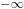 and policy performance could crater; in fact, it usually will. Sometimes a deep RL researcher might describe this outcome as the policy “overfitting” to a batch of data. This is descriptive, but should not be taken literally because it does not refer to generalization error.
>
> We raise this point because it is common for ML practitioners to interpret a loss function as a useful signal during training—”if the loss goes down, all is well.” In policy gradients, this intuition is wrong, and you should only care about average return. The loss function means nothing.

The approach used here to make the `log_probs` tensor—creating an action mask, and using it to select out particular log probabilities—*only* works for categorical policies. It does not work in general.

**3. Running One Epoch of Training.**

```python
  # for training policy
    def train_one_epoch():
        # make some empty lists for logging.
        batch_obs = []          # for observations
        batch_acts = []         # for actions
        batch_weights = []      # for R(tau) weighting in policy gradient
        batch_rets = []         # for measuring episode returns
        batch_lens = []         # for measuring episode lengths

        # reset episode-specific variables
        obs = env.reset()       # first obs comes from starting distribution
        done = False            # signal from environment that episode is over
        ep_rews = []            # list for rewards accrued throughout ep

        # render first episode of each epoch
        finished_rendering_this_epoch = False

        # collect experience by acting in the environment with current policy
        while True:

            # rendering
            if not(finished_rendering_this_epoch):
                env.render()

            # save obs
            batch_obs.append(obs.copy())

            # act in the environment
            act = sess.run(actions, {obs_ph: obs.reshape(1,-1)})[0]
            obs, rew, done, _ = env.step(act)

            # save action, reward
            batch_acts.append(act)
            ep_rews.append(rew)

            if done:
                # if episode is over, record info about episode
                ep_ret, ep_len = sum(ep_rews), len(ep_rews)
                batch_rets.append(ep_ret)
                batch_lens.append(ep_len)

                # the weight for each logprob(a|s) is R(tau)
                batch_weights += [ep_ret] * ep_len

                # reset episode-specific variables
                obs, done, ep_rews = env.reset(), False, []

                # won't render again this epoch
                finished_rendering_this_epoch = True

                # end experience loop if we have enough of it
                if len(batch_obs) > batch_size:
                    break

        # take a single policy gradient update step
        batch_loss, _ = sess.run([loss, train_op],
                                 feed_dict={
                                    obs_ph: np.array(batch_obs),
                                    act_ph: np.array(batch_acts),
                                    weights_ph: np.array(batch_weights)
                                 })
        return batch_loss, batch_rets, batch_lens
```

The `train_one_epoch()` function runs one “epoch” of policy gradient, which we define to be

1. the experience collection step (L62-97), where the agent acts for some number of episodes in the environment using the most recent policy, followed by
2. a single policy gradient update step (L99-105).

The main loop of the algorithm just repeatedly calls `train_one_epoch()`.

### Expected Grad-Log-Prob Lemma

In this subsection, we will derive an intermediate result which is extensively used throughout the theory of policy gradients. We will call it the Expected Grad-Log-Prob (EGLP) lemma.

**EGLP Lemma.** Suppose that 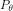 is a parameterized probability distribution over a random variable, 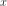. Then:


Recall that all probability distributions are *normalized*:


Take the gradient of both sides of the normalization condition:


Use the log derivative trick to get:


### Don’t Let the Past Distract You

Examine our most recent expression for the policy gradient:


Taking a step with this gradient pushes up the log-probabilities of each action in proportion to , the sum of *all rewards ever obtained*. But this doesn’t make much sense.

Agents should really only reinforce actions on the basis of their *consequences*. Rewards obtained before taking an action have no bearing on how good that action was: only rewards that come *after*.

It turns out that this intuition shows up in the math, and we can show that the policy gradient can also be expressed by


In this form, actions are only reinforced based on rewards obtained after they are taken.

We’ll call this form the “reward-to-go policy gradient,” because the sum of rewards after a point in a trajectory,


is called the **reward-to-go** from that point, and this policy gradient expression depends on the reward-to-go from state-action pairs.

> **But how is this better?** A key problem with policy gradients is how many sample trajectories are needed to get a low-variance sample estimate for them. The formula we started with included terms for reinforcing actions proportional to past rewards, all of which had zero mean, but nonzero variance: as a result, they would just add noise to sample estimates of the policy gradient. By removing them, we reduce the number of sample trajectories needed.

### Implementing Reward-to-Go Policy Gradient

The only thing that has changed from `1_simple_pg.py` is that we now use different weights in the loss function. The code modification is very slight: we add a new function, and change two other lines. The new function is:

```python
def reward_to_go(rews):
    n = len(rews)
    rtgs = np.zeros_like(rews)
    for i in reversed(range(n)):
        rtgs[i] = rews[i] + (rtgs[i+1] if i+1 < n else 0)
    return rtgs
```

And then we tweak the old L86-87 from:

```python
                # the weight for each logprob(a|s) is R(tau)
                batch_weights += [ep_ret] * ep_len
```

to:

```python
                # the weight for each logprob(a_t|s_t) is reward-to-go from t
                batch_weights += list(reward_to_go(ep_rews))
```

### Baselines in Policy Gradients

An immediate consequence of the EGLP lemma is that for any function  which only depends on state,


This allows us to add or subtract any number of terms like this from our expression for the policy gradient, without changing it in expectation:


Any function 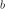used in this way is called a **baseline**.

The most common choice of baseline is the [on-policy value function](https://spinningup.openai.com/en/latest/spinningup/rl_intro.html#value-functions) . Recall that this is the average return an agent gets if it starts in state 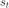 and then acts according to policy 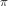 for the rest of its life.

Empirically, the choice  has the desirable effect of reducing variance in the sample estimate for the policy gradient. This results in faster and more stable policy learning. It is also appealing from a conceptual angle: it encodes the intuition that if an agent gets what it expected, it should “feel” neutral about it.

In practice,  cannot be computed exactly, so it has to be approximated. This is usually done with a neural network, , which is updated concurrently with the policy (so that the value network always approximates the value function of the most recent policy).

The simplest method for learning 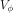, used in most implementations of policy optimization algorithms (including VPG, TRPO, PPO, and A2C), is to minimize a mean-squared-error objective:


where 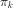 is the policy at epoch 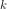. This is done with one or more steps of gradient descent, starting from the previous value parameters 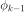.

### Other Forms of the Policy Gradient

What we have seen so far is that the policy gradient has the general form


where  could be any of


or


or


All of these choices lead to the same expected value for the policy gradient, despite having different variances. It turns out that there are two more valid choices of weights 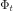 which are important to know.

**1. On-Policy Action-Value Function.** The choice


is also valid. See [this page](https://spinningup.openai.com/en/latest/spinningup/extra_pg_proof2.html) for an (optional) proof of this claim.

**2. The Advantage Function.** Recall that the [advantage of an action](https://spinningup.openai.com/en/latest/spinningup/rl_intro.html#advantage-functions), defined by , describes how much better or worse it is than other actions on average (relative to the current policy). This choice,


is also valid. The proof is that it’s equivalent to using  and then using a value function baseline, which we are always free to do.

