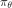
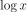
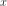
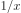
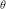
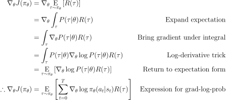
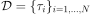
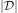
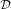
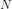

# OpenAI Spinning Up

## 3. Intro to Policy Optimization

URL: https://spinningup.openai.com/en/latest/spinningup/rl_intro3.html

We will cover three key results in the theory of **policy gradients**:

- [the simplest equation](https://spinningup.openai.com/en/latest/spinningup/rl_intro3.html#deriving-the-simplest-policy-gradient) describing the gradient of policy performance with respect to policy parameters,
- a rule which allows us to [drop useless terms](https://spinningup.openai.com/en/latest/spinningup/rl_intro3.html#don-t-let-the-past-distract-you) from that expression,
- and a rule which allows us to [add useful terms](https://spinningup.openai.com/en/latest/spinningup/rl_intro3.html#baselines-in-policy-gradients) to that expression.

In the end, we’ll tie those results together and describe the advantage-based expression for the policy gradient—the version we use in our [Vanilla Policy Gradient](https://spinningup.openai.com/en/latest/algorithms/vpg.html) implementation.

### Deriving the Simplest Policy Gradient

Here, we consider the case of a stochastic, parameterized policy, . We aim to maximize the expected return . For the purposes of this derivation, we’ll take  to give the [finite-horizon undiscounted return](https://spinningup.openai.com/en/latest/spinningup/rl_intro.html#reward-and-return), but the derivation for the infinite-horizon discounted return setting is almost identical.

We would like to optimize the policy by gradient ascent, eg


The gradient of policy performance, , is called the **policy gradient**, and algorithms that optimize the policy this way are called **policy gradient algorithms.** (Examples include Vanilla Policy Gradient and TRPO. PPO is often referred to as a policy gradient algorithm, though this is slightly inaccurate.)

To actually use this algorithm, we need an expression for the policy gradient which we can numerically compute. This involves two steps: 

1. deriving the analytical gradient of policy performance, which turns out to have the form of an expected value, and then
2. forming a sample estimate of that expected value, which can be computed with data from a finite number of agent-environment interaction steps.

In this subsection, we’ll find the simplest form of that expression. In later subsections, we’ll show how to improve on the simplest form to get the version we actually use in standard policy gradient implementations.

We’ll begin by laying out a few facts which are useful for deriving the analytical gradient.

**1. Probability of a Trajectory.** The probability of a trajectory  given that actions come from  is


**2. The Log-Derivative Trick.** The log-derivative trick is based on a simple rule from calculus: the derivative of  with respect to  is . When rearranged and combined with chain rule, we get:


**3. Log-Probability of a Trajectory.** The log-prob of a trajectory is just


**4. Gradients of Environment Functions.** The environment has no dependence on , so gradients of , , and  are zero.

**5. Grad-Log-Prob of a Trajectory.** The gradient of the log-prob of a trajectory is thus


**Derivation for Basic Policy Gradient**



This is an expectation, which means that we can estimate it with a sample mean. If we collect a set of trajectories  where each trajectory is obtained by letting the agent act in the environment using the policy , the policy gradient can be estimated with


where  is the number of trajectories in  (here, ).

This last expression is the simplest version of the computable expression we desired. Assuming that we have represented our policy in a way which allows us to calculate , and if we are able to run the policy in the environment to collect the trajectory dataset, we can compute the policy gradient and take an update step.

### Implementing the Simplest Policy Gradient

We give a short Tensorflow implementation of this simple version of the policy gradient algorithm in `spinup/examples/pg_math/1_simple_pg.py`. (It can also be viewed [on github](https://github.com/openai/spinningup/blob/master/spinup/examples/pg_math/1_simple_pg.py).) It is only 122 lines long, so we highly recommend reading through it in depth. While we won’t go through the entirety of the code here, we’ll highlight and explain a few important pieces.

**1. Making the Policy Network.**

```python
# make core of policy network
obs_ph = tf.placeholder(shape=(None, obs_dim),dtype=tf.float32)
logits = mlp(obs_ph, sizes=hidden_sizes+[n_acts])

# make action selection op (outputs int actions, sampled from policy)
actions = tf.squeeze(tf.multinomial(logits=logits, num_samples=1), axis=1)
```

This block builds a feedforward neural network categorical policy. (See the [Stochastic Policies](https://spinningup.openai.com/en/latest/spinningup/rl_intro.html#stochastic-policies) section in Part 1 for a refresher.) The `logits` tensor can be used to construct log-probabilities and probabilities for actions, and the `actions` tensor samples actions based on the probabilities implied by `logits`.

**2. Making the Loss Function.**

```python
# make loss function whose gradient, for the right data, is policy gradient
weights_ph = tf.placeholder(shape=(None,), dtype=tf.float32)
act_ph = tf.placeholder(shape=(None,), dtype=tf.int32)
action_masks = tf.one_hot(act_ph, n_acts)
log_probs = tf.reduce_sum(action_masks * tf.nn.log_softmax(logits), axis=1)
loss = -tf.reduce_mean(weights_ph * log_probs)
```


