# OpenAI Spinning Up

## 1. Key Concepts in RL

URL: https://spinningup.openai.com/en/latest/spinningup/rl_intro.html

### Key Concepts and Terminology


The main characters of RL are the **agent** and the **environment**. The environment is the world that the agent lives in and interacts with.

The agent also perceives a **reward** signal from the environment, a number that tells it how good or bad the current world state is.

The goal of the agent is to maximize its cumulative reward, called **return**.

- states and observations,
- action spaces,
- policies,
- trajectories,
- different formulations of return,
- the RL optimization problem,
- and value functions.

#### States and Observations

- **state** $s$ : a complete description of the state of the world.

- **observation** $o$ : a partial description of a state, which may omit information.

#### Action Spces

- **action space**: The set of all valid actions in a given environment
  - **Discrete action spaces**
  - **Continuous action spaces**

#### Policies

- **policy**: a rule used by an agent to decide what actions to take.
  - **deterministic**: $a_t=\mu(s_t)$
  - **stochastic**: $a_t=\pi( \cdot |s_t)$
- In deep RL, we deal with **parameterized policies**: policies whose outputs are computable functions that depend on a set of parameters (eg the weights and biases of a neural network) which we can adjust to change the behavior via some optimization algorithm.
  - **deterministic**: $a_t=\mu_\theta(s_t)$
  - **stochastic**: $a_t=\pi_\theta( \cdot |s_t)$

#### Deterministic Policies

**Sample:**

```
obs = tf.placeholder(shape=(None, obs_dim), dtype=tf.float32)
net = mlp(obs, hidden_dims=(64,64), activation=tf.tanh)
actions = tf.layers.dense(net, units=act_dim, activation=None)
```

#### Stochastic Policies

The two most common kinds of stochastic policies in deep RL are **categorical policies** and **diagonal Gaussian policies**.

Two key computations are centrally important for using and training stochastic policies:

- sampling actions from the policy,
- and computing log likelihoods of particular actions, $\log\pi_\theta(a|s)$.

- **Categorical policies** for discrete actions spaces.
  - **Sampling.** Given the probabilities for each action, frameworks like Tensorflow have built-in tools for sampling.
  - **Log-Likelihood.** Denote the last layer of probabilities as . It is a vector with however many entries as there are actions, so we can treat the actions as indices for the vector. The log likelihood for an action  can then be obtained by indexing into the vector: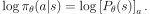

- **Diagonal Gaussian policies** for continuous action spaces.

  - A multivariate Gaussian distribution (or multivariate normal distribution, if you prefer) is described by a mean vector, 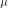, and a covariance matrix, 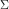. A diagonal Gaussian distribution is a special case where the covariance matrix only has entries on the **diagonal**. As a result, we can represent it by a vector.

  - A diagonal Gaussian policy always has a neural network that maps from observations to mean actions, . There are two different ways that the covariance matrix is typically represented.

    1. There is a single vector of log standard deviations, 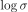, which is **not** a function of state: the  are standalone parameters. (You Should Know: our implementations of VPG, TRPO, and PPO do it this way.)
    2. There is a neural network that maps from states to log standard deviations, . It may optionally share some layers with the mean network.

    - Note: use log standard deviations instead of standard deviations directly. Because log stds are free to take on any values in , while stds must be nonnegative.

  - **Sampling.** Given the mean action  and standard deviation , and a vector 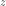 of noise from a spherical Gaussian (), an action sample can be computed with

    

    where 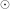 denotes the elementwise product of two vectors. 

  - **Log-Likelihood.** The log-likelihood of a  -dimensional action 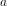, for a diagonal Gaussian with mean  and standard deviation , is given by

$$
\pi_\theta(a_i|s)=\frac{1}{\sqrt{2\pi \sigma_i^2}}e^{-\frac{(x-\mu_i)^2}{2\sigma^2}}
$$

​											

#### Trajectories

A trajectory 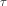 is a sequence of states and actions in the world,


The very first state of the world, 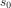, is randomly sampled from the **start-state distribution**, sometimes denoted by :


State transitions (what happens to the world between the state at time 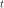, , and the state at 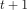, 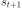), are governed by the natural laws of the environment, and depend on only the most recent action, 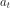. They can be either deterministic,


or stochastic,


Actions come from an agent according to its policy.

#### Reward and Return

The reward function 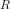 depends on the current state of the world, the action just taken, and the next state of the world:


although frequently this is simplified to just a dependence on the current state, , or state-action pair .

The goal of the agent is to maximize some notion of cumulative reward over a trajectory.

- One kind of return is the **finite-horizon undiscounted return**, which is just the sum of rewards obtained in a fixed window of steps:

  

  Another kind of return is the **infinite-horizon discounted return**, which is the sum of all rewards *ever* obtained by the agent, but discounted by how far off in the future they’re obtained. This formulation of reward includes a discount factor :

  

#### The RL Problem

The goal in RL is to select a policy which maximizes **expected return** when the agent acts according to it.

Let’s suppose that both the environment transitions and the policy are stochastic. In this case, the probability of a 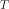 -step trajectory is:


The expected return (for whichever measure), denoted by , is then:


The central optimization problem in RL can then be expressed by


with 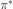 being the **optimal policy**.

#### Value Functions

It’s often useful to know the **value** of a state, or state-action pair. By value, we mean the expected return if you start in that state or state-action pair, and then act according to a particular policy forever after. **Value functions** are used, one way or another, in almost every RL algorithm.

There are four main functions of note here.

1. The **On-Policy Value Function**, , which gives the expected return if you start in state  and always act according to policy :

   > 

2. The **On-Policy Action-Value Function**, , which gives the expected return if you start in state , take an arbitrary action  (which may not have come from the policy), and then forever after act according to policy :

   > 

3. The **Optimal Value Function**, , which gives the expected return if you start in state  and always act according to the *optimal* policy in the environment:

   > 

4. The **Optimal Action-Value Function**, , which gives the expected return if you start in state , take an arbitrary action , and then forever after act according to the *optimal* policy in the environment:

   > 

- Note: There are two key connections between the value function and the action-value function that come up pretty often:

  - 
    - 

  - 

#### The Optimal Q-Function and the Optimal Action

There is an important connection between the optimal action-value function  and the action selected by the optimal policy. By definition,  gives the expected return for starting in state , taking (arbitrary) action , and then acting according to the optimal policy forever after.

The optimal policy in  will select whichever action maximizes the expected return from starting in . As a result, if we have , we can directly obtain the optimal action, , via


Note: there may be multiple actions which maximize , in which case, all of them are optimal, and the optimal policy may randomly select any of them. But there is always an optimal policy which deterministically selects an action.

### Bellman Equations

All four of the value functions obey special self-consistency equations called **Bellman equations**. The basic idea behind the Bellman equations is this:

> The value of your starting point is the reward you expect to get from being there, plus the value of wherever you land next.

The Bellman equations for the on-policy value functions are


where 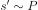 is shorthand for , indicating that the next state  is sampled from the environment’s transition rules; 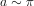 is shorthand for ; and 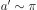 is shorthand for .

The Bellman equations for the optimal value functions are


The crucial difference between the Bellman equations for the on-policy value functions and the optimal value functions, is the absence or presence of the 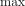over actions. Its inclusion reflects the fact that whenever the agent gets to choose its action, in order to act optimally, it has to pick whichever action leads to the highest value.

> The term “Bellman backup” comes up quite frequently in the RL literature. The Bellman backup for a state, or state-action pair, is the right-hand side of the Bellman equation: the reward-plus-next-value.

#### Advantage Functions

Sometimes in RL, we don’t need to describe how good an action is in an absolute sense, but only how much better it is than others on average. That is to say, we want to know the relative **advantage** of that action. We make this concept precise with the **advantage function.**

The advantage function  corresponding to a policy  describes how much better it is to take a specific action  in state 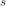, over randomly selecting an action according to , assuming you act according to  forever after. Mathematically, the advantage function is defined by


## [(Optional) Formalism](https://spinningup.openai.com/en/latest/spinningup/rl_intro.html#id5)

So far, we’ve discussed the agent’s environment in an informal way, but if you try to go digging through the literature, you’re likely to run into the standard mathematical formalism for this setting: **Markov Decision Processes** (MDPs). An MDP is a 5-tuple, 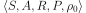, where

- 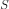 is the set of all valid states,
- 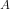 is the set of all valid actions,
- 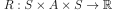 is the reward function, with ,
-  is the transition probability function, with  being the probability of transitioning into state 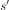 if you start in state  and take action ,
- and 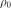 is the starting state distribution.

The name Markov Decision Process refers to the fact that the system obeys the [Markov property](https://en.wikipedia.org/wiki/Markov_property): transitions only depend on the most recent state and action, and no prior history.


